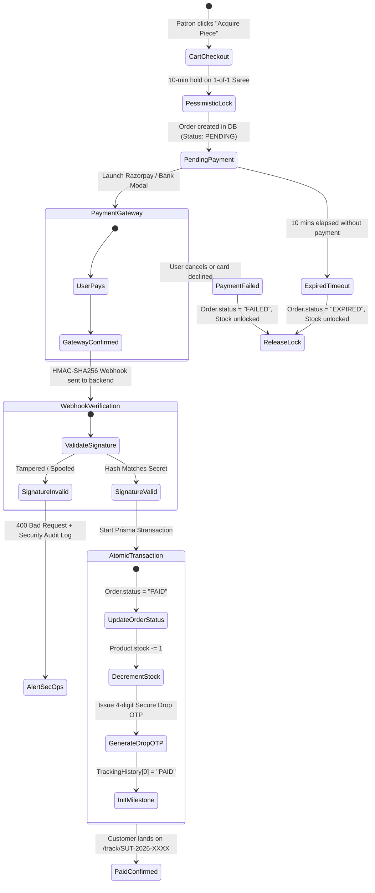

# 💳 Payment & Logistics Integration Specification

This document details the production architecture, verification state machines, and fulfillment operations for **Payment Gateways (Razorpay)** and **Logistics Dispatch Operations** on the Sutraಧಾರ luxury handloom e-commerce platform.

---

## 📌 1. Mode Overview

| Feature | Operational / Phase 1 Mode | Automated Phase 2 Mode |
| :--- | :--- | :--- |
| **Payment Status** | Instant `PAID` state upon placing order / Verified | Starts as `PENDING`, transitions to `PAID` **strictly after server-side HMAC-SHA256 signature verification** |
| **Stock Decrement** | Decrements immediately on confirmed order placement | **Atomic decrement inside database transaction ONLY upon confirmed payment** |
| **1-of-1 Heirloom Lock** | In-memory 10-minute pessimistic lock | Distributed Redis/DB 10-min lock; auto-released on payment failure/timeout |
| **Logistics Dispatch** | **In-House Logistics Vault with multi-carrier dispatch & manual AWB logging** | Optional automated Courier API booking |
| **Pre-Shipment QC** | Internal 20s pre-dispatch video recorded, attached to order | Encrypted inspection video stored in S3/Cloudinary vault |

---

## 🛡️ 2. Production Payment State Machine (2-Phase Lifecycle)

No order is marked as `PAID` and no stock is permanently deducted without cryptographic proof of payment from the gateway.



---

## 🔐 3. Cryptographic Webhook Verification Protocol

### A. Webhook Route (`POST /api/v1/payments/webhook`)
Razorpay will send an event payload (`payment.captured` or `order.paid`) with an `x-razorpay-signature` header.

### B. Verification Formula:
```typescript
import crypto from 'crypto';

export async function handleRazorpayWebhook(req: Request, res: Response) {
  const secret = process.env.RAZORPAY_WEBHOOK_SECRET!;
  const signature = req.headers['x-razorpay-signature'] as string;
  const rawBody = JSON.stringify(req.body);

  const expectedSignature = crypto
    .createHmac('sha256', secret)
    .update(rawBody)
    .digest('hex');

  if (expectedSignature !== signature) {
    console.error('⚠️ [SECURITY AUDIT] Invalid webhook signature received!');
    return res.status(400).json({ error: 'Invalid webhook signature.' });
  }

  const event = req.body.event;
  if (event === 'payment.captured' || event === 'order.paid') {
    const paymentData = req.body.payload.payment.entity;
    const orderNumber = paymentData.notes?.orderNumber;

    // Execute Atomic State Transition
    await prisma.$transaction(async (tx) => {
      const order = await tx.order.findUnique({
        where: { orderNumber },
        include: { items: true },
      });

      if (!order || order.status === 'PAID') {
        return; // Idempotency check: Already processed
      }

      // 1. Mark as PAID
      await tx.order.update({
        where: { id: order.id },
        data: {
          status: 'PAID',
          trackingHistory: [
            {
              id: `evt-${Date.now()}`,
              status: 'PAID',
              location: 'Varanasi Master Loom Vault',
              message: `Payment verified via Razorpay (TxID: ${paymentData.id}). Saree piece allocated in luxury trunk.`,
              timestamp: new Date().toISOString(),
            },
          ],
        },
      });

      // 2. Decrement physical stock
      for (const item of order.items) {
        await tx.product.update({
          where: { id: item.productId },
          data: { stock: { decrement: item.quantity } },
        });
      }
    });
  }

  return res.json({ status: 'ok' });
}
```

---

## 📦 4. High-Assurance Logistics & Fulfillment Protocol

### A. 8-Stage Milestone Lifecycle
Sutradara orders follow an explicit milestone progression:

1. **`PENDING`**: Order registered, awaiting payment authorization.
2. **`PAID`**: Payment verified. Stock allocated and reserved in warehouse.
3. **`QC_INSPECTED`**: Pre-shipment ultra-high-definition 20s inspection video recorded and verified by Master Curator.
4. **`PROCESSING`**: Piece steamed, folded, and sealed in a luxury heritage trunk with tamper-evident serial tape.
5. **`SHIPPED`**: Handed over to selected air express courier with assigned AWB tracking number.
6. **`IN_TRANSIT`**: Air shipment moving through airport gateway hub / destination sorting center.
7. **`OUT_FOR_DELIVERY`**: White-glove van out for delivery to patron residence.
8. **`DELIVERED`**: Secure handover complete and accepted by recipient.
9. **`CANCELLED` / `RETURNED` / `NDR EXCEPTION`**: Non-delivery exception flagged for immediate staff customer outreach.

### B. Supported Courier Partners
The Admin Dispatch Desk supports multi-courier selection:
* **Bluedart Apex Air** (Primary express for luxury sarees $\ge$ ₹20,000)
* **Delhivery Express**
* **DTDC Express**
* **Speed Post (India Post)**
* **The Professional Couriers**
* **Shadowfax Air**
* **Xpressbees Logistics**
* **In-House White-Glove Handover**

### C. Live Customer Tracking (`/track/[orderNumber]`)
* Accessible by the patron using their unique Order Number (e.g. `SUT-2026-3253`).
* Displays chronological satellite timeline with GPS/hub checkpoints, status badges, courier name, and AWB link.
* Pre-shipment QC verification evidence is displayed to assure handloom authenticity.

---

## 🚀 5. Checklist to Switch to Live Accounts

When ready to connect live payment and courier production accounts:

- [ ] **1. Add Environment Secrets (`backend/.env`):**
  ```env
  RAZORPAY_KEY_ID="rzp_live_xxxxxxxxxxxxxx"
  RAZORPAY_KEY_SECRET="xxxxxxxxxxxxxxxxxxxxxxxx"
  RAZORPAY_WEBHOOK_SECRET="whsec_xxxxxxxxxxxxxx"
  ```
- [ ] **2. Activate 2-Phase Order Controller:**
  * Ensure `handleRazorpayWebhook` is connected to live Razorpay webhook dashboard pointing to `https://api.sutradara.in/api/v1/payments/webhook`.
- [ ] **3. Test Live Small-Amount Transaction:**
  * Perform a live ₹1 test transaction on Razorpay to verify webhook delivery, stock decrement, and live tracking generation.
