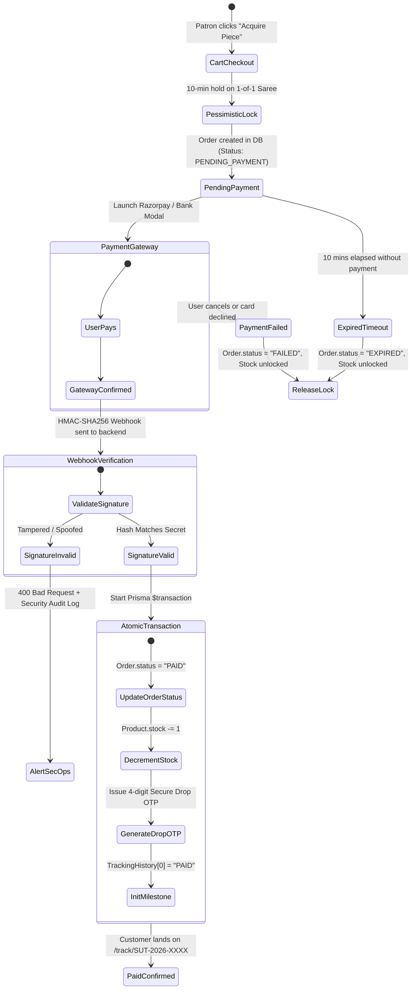

# 💳 Payment & Logistics Integration Specification

This document details the exact production architecture, verification state machines, and activation steps for **Payment Gateway (Razorpay)** and **Logistics Logistics (Shiprocket / Bluedart Air)** on the Sutraಧಾರ luxury handloom e-commerce platform.

---

## 📌 1. Mode Overview

| Feature | Development Mode (Current) | Production Mode (Planned Integration) |
| :--- | :--- | :--- |
| **Payment Status** | Instant `PAID` state upon placing order | Starts as `PENDING_PAYMENT`, transitions to `PAID` **strictly after server-side HMAC-SHA256 signature verification** |
| **Stock Decrement** | Decrements immediately on simulated order placement | **Atomic decrement inside database transaction ONLY upon confirmed payment** |
| **1-of-1 Heirloom Lock** | In-memory 10-minute pessimistic lock | Distributed Redis/DB 10-min lock; auto-released on payment failure/timeout |
| **Logistics / AWB** | Simulated `Bluedart Apex Air` with realistic `BD-XXXXXXXXIN` AWBs | Live Shiprocket API with automated Bluedart Air pickup & AWB generation |
| **Pre-Shipment QC** | Internal video attachment in staff portal | Internal 20s pre-dispatch video recorded, encrypted, and attached |

---

## 🛡️ 2. Production Payment State Machine (2-Phase Lifecycle)

In production, no order will ever be marked as `PAID` and no stock will be permanently deducted without cryptographic proof of payment from the gateway.



---

## 🔐 3. Cryptographic Webhook Verification Protocol

### A. Webhook Route (`POST /api/v1/payments/webhook`)
Razorpay will send an event payload (`payment.captured` or `order.paid`) with an `x-razorpay-signature` header.

### B. Verification Formula:
```typescript
import crypto from 'crypto';

export async function handleRazorpayWebhook(req: Request, res: Response) {
  const secret = process.env.RAZORPAY_WEBHOOK_SECRET!;
  const signature = req.headers['x-razorpay-signature'] as string;
  const rawBody = JSON.stringify(req.body);

  const expectedSignature = crypto
    .createHmac('sha256', secret)
    .update(rawBody)
    .digest('hex');

  if (expectedSignature !== signature) {
    console.error('⚠️ [SECURITY AUDIT] Invalid webhook signature received!');
    return res.status(400).json({ error: 'Invalid webhook signature.' });
  }

  const event = req.body.event;
  if (event === 'payment.captured' || event === 'order.paid') {
    const paymentData = req.body.payload.payment.entity;
    const orderNumber = paymentData.notes?.orderNumber;

    // Execute Atomic State Transition
    await prisma.$transaction(async (tx) => {
      const order = await tx.order.findUnique({
        where: { orderNumber },
        include: { items: true },
      });

      if (!order || order.status === 'PAID') {
        return; // Idempotency check: Already processed
      }

      // 1. Mark as PAID
      await tx.order.update({
        where: { id: order.id },
        data: {
          status: 'PAID',
          trackingHistory: [
            {
              id: `evt-${Date.now()}`,
              status: 'PAID',
              location: 'Varanasi Master Loom Vault',
              message: `Payment verified via Razorpay (TxID: ${paymentData.id}). Saree piece allocated in luxury trunk.`,
              timestamp: new Date().toISOString(),
            },
          ],
        },
      });

      // 2. Decrement physical stock
      for (const item of order.items) {
        await tx.product.update({
          where: { id: item.productId },
          data: { stock: { decrement: item.quantity } },
        });
      }
    });
  }

  return res.json({ status: 'ok' });
}
```

---

## 📦 4. Shiprocket & Logistics Production Protocol

### A. Courier Partner Strategy
* **Primary Air Express:** `Bluedart Apex Air` (for luxury handlooms $\ge$ ₹20,000)
* **High-Value Insurance:** Mandatory 100% declared value insurance on transit
* **Doorstep Verification:** 4-Digit Secure Drop OTP must be entered into courier handheld device before physical handover.

### B. Fulfillment Workflow:
1. **Quality Check & Video Attachment:**
   * Warehouse staff inspects the saree on camera (Silk Mark hologram, gold zari test).
   * Staff uploads video via staff portal $\rightarrow$ saved to internal S3 vault.
   * Order status updated to `QC_INSPECTED`.
2. **Automated Shiprocket AWB Generation:**
   * Backend invokes Shiprocket API:
     ```http
     POST https://apiv2.shiprocket.in/v1/external/orders/create/adhoc
     Authorization: Bearer <SHIPROCKET_JWT>
     ```
   * Assigns Bluedart Air courier and retrieves live `awbNumber` and `trackingUrl`.
3. **Packaging in Sealed Heritage Trunk:**
   * Package sealed with serial tamper-evident tape.
   * Order status transitions to `DISPATCHED` / `SHIPPED`.
4. **Live Satellite Milestone Sync:**
   * Shiprocket tracking webhooks automatically push GPS/hub updates (`IN_TRANSIT` $\rightarrow$ `OUT_FOR_DELIVERY` $\rightarrow$ `DELIVERED`).

---

## 🚀 5. Checklist to Switch from Development to Production

When ready to connect real payment and courier accounts:

- [ ] **1. Add Environment Secrets (`backend/.env`):**
  ```env
  RAZORPAY_KEY_ID="rzp_live_xxxxxxxxxxxxxx"
  RAZORPAY_KEY_SECRET="xxxxxxxxxxxxxxxxxxxxxxxx"
  RAZORPAY_WEBHOOK_SECRET="whsec_xxxxxxxxxxxxxx"
  SHIPROCKET_EMAIL="logistics@sutradara.in"
  SHIPROCKET_PASSWORD="xxxxxxxxxxxxxxxx"
  ```
- [ ] **2. Activate 2-Phase Order Controller:**
  * Update `backend/src/controllers/customer/orders.controller.ts` to set initial order status as `PENDING_PAYMENT`.
  * Enable the HMAC-SHA256 webhook listener in `backend/src/controllers/payments.controller.ts`.
- [ ] **3. Connect Shiprocket API Client:**
  * Configure automatic Bluedart Air dispatch trigger upon staff marking order as `QC_INSPECTED`.
- [ ] **4. Test Live Small-Amount Transaction:**
  * Perform a live ₹1 test transaction on Razorpay to verify webhook delivery, stock decrement, and live tracking generation.
